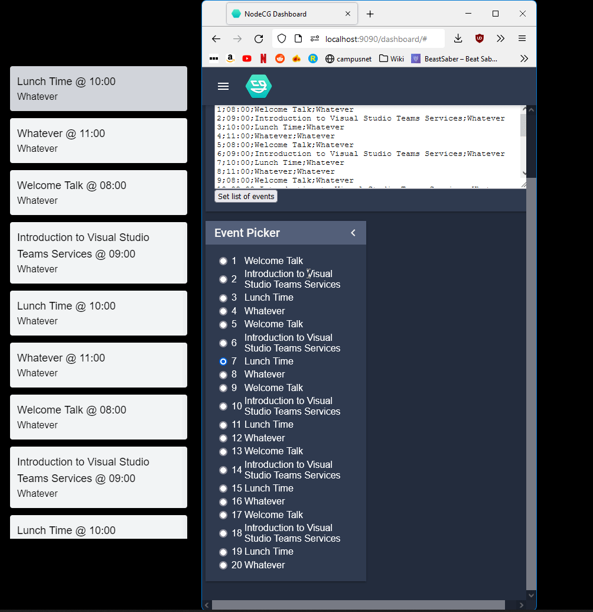

# Royal Hackaway

- [Website](https://royalhackaway.com)
  - [Hackaway v5](https://royalhackaway.com/events/hackawayv5/)
  - [~~freshers hack~~](https://royalhackaway.com/events/freshers2021/)
  - [~~Hackaway v4~~](https://royalhackaway.com/events/hackawayv4/)

# Information

The Royal Hackaway NodeCG bundle includes both controls and the frontend graphics visible on stream.

## Running

To run this project:

1. Install the dependencies for the bundle
   - Run `yarn` in the root folder
2. Build the NodeCG bundle
   - `yarn build`
3. Install the dependencies for NodeCG
   - Go into the `nodecg` directory
   - Run `npm i`
4. You may now start the project
   - Return to the root folder
   - `yarn start`
   - `yarn dev` (for live reload!)

## Updating NodeCG

NodeCG is included as a submodule to keep things stable.
Update NodeCG by bringing the submodule up to date with `master`.

# Images

# Contributing

- Please check Notion, open issues and PRs before working on anything or opening a new one!
- Please ensure you have run `yarn format` before pushing new code.
