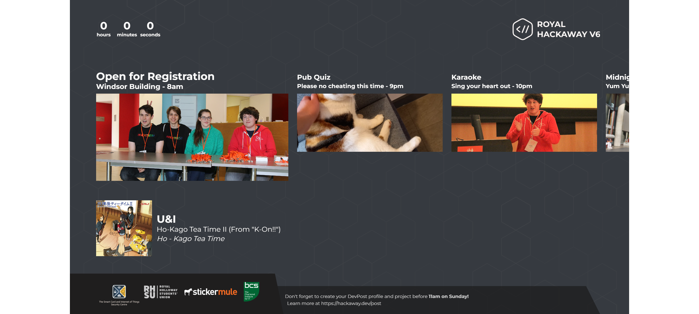

# Royal Hackaway Overlay

This is the Royal Hackaway overlay bundle, which includes includes both controls and the frontend graphics visible on stream.

See it in action in our [Best Bits](https://www.youtube.com/watch?v=-4O3grBFW0s) video on YouTube.

## Running

To run this project:

1. Clone the project properly
   - `git clone --recursive https://github.com/rhul-compsoc/hackaway-overlay.git`
   - If you forgot to do that properly, initialise the submodules yourself
   - `git submodule update --init --recursive --remote`
2. Install the dependencies for the bundle
   - Run `yarn` in the root folder
3. Run a development environment
   - `yarn start`

## Updating NodeCG

NodeCG is included as a submodule to keep things stable.
Update NodeCG by bringing the submodule up to date with `master`.

# Contributing

- Please check Notion, open issues and PRs before working on anything or opening a new one!
- Please ensure you have run `yarn format` before pushing new code.
